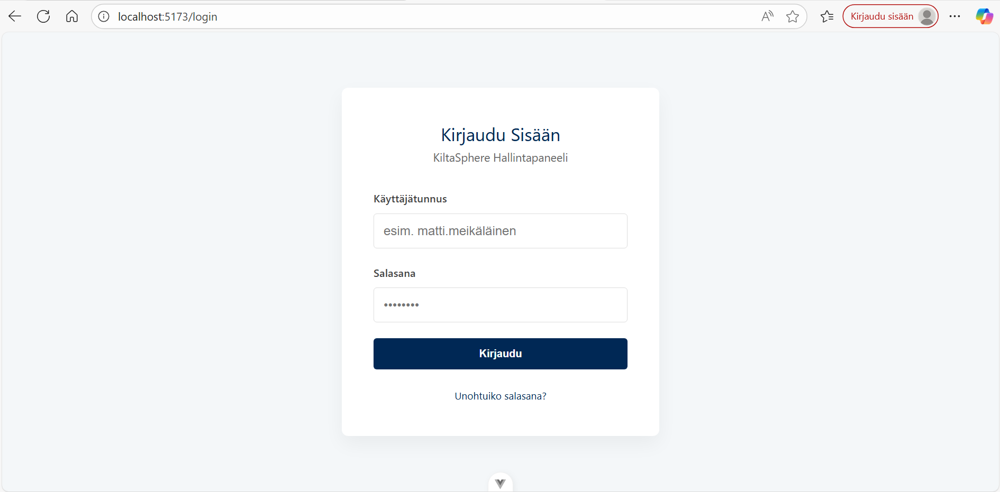
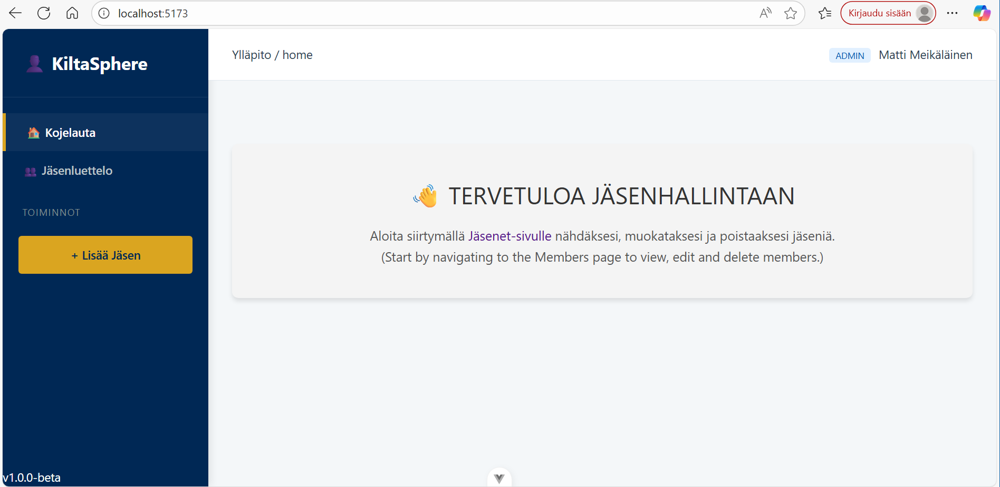
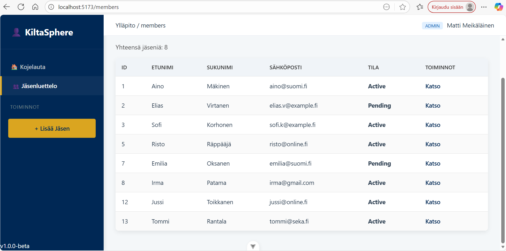
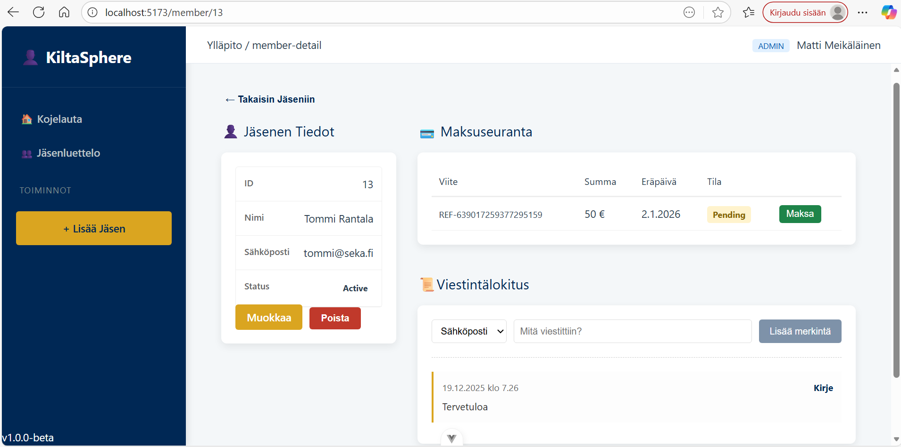

# KiltaSphere: Modern Full-Stack Registry & Operations Portal

> **A professional demonstration of secure, scalable and localized business solutions using .NET 8 and Vue 3, tailored for organizational management in the Finnish market.**

KiltaSphere is a high-availability, full-stack application designed to manage complex member data, payment tracking and communication logs. It mirrors the requirements of real-world Finnish "Kilta" systems used by unions and associations (yhdistykset), focusing on data integrity, auditability and role-based security.

---

## 🛠️ Technology Stack

| Category | Technology | Focus Area |
| :--- | :--- | :--- |
| **Backend** | **C# / .NET 8** | High-performance RESTful API with ASP.NET Core. |
| **Frontend** | **Vue.js 3** | Composition API & Pinia for reactive state management. |
| **Security** | **JWT & BCrypt** | Token-based sessions with industry-standard password hashing. |
| **Architecture** | **Multi-Shell** | Service/Repository pattern with specialized UI Layouts (Admin/Member). |
| **Database** | **MS SQL Server** | EF Core for relational modeling and complex registry queries. |
| **DevOps** | **Docker** | Containerized frontend for environment independence. |

---

## ✨ Core Features & Business Logic

The application demonstrates competency in handling sensitive enterprise data and complex user flows:

1. **Jäsenrekisteri (Member Registry):** Full CRUD operations for member profiles with strict data validation.
2. **Monitasoinen Käyttöliittymä (Multi-Layout Shell):** Dynamic UI switching between **Admin Dashboard** (Sidebar-driven), **Member Portal** (Self-service) and **Auth** (Centered-focus) environments.
3. **Maksuseuranta (Payment Tracking):** Detailed ledger for tracking membership fees, dues and payment history.
4. **Viestintälokitus (Communication Logs):** A centralized audit trail of member interactions (emails, SMS) linked to the specific Admin user who performed the action.
5. **Localization:** Fully localized Finnish UI/UX, respecting local organizational terminology.

---

## 🔐 Enterprise Security Implementation

KiltaSphere implements a robust security model that balances user experience with data protection:

* **JWT Authentication:** Secure token-based flow with persistence and automatic session recovery.
* **RBAC (Role-Based Access Control):** Claims-based authorization restricting access to Administrative tools vs. Member-only views.
* **Axios Interceptors:** Global request middleware for automated Bearer token injection and global 401 (Unauthorized) handling.
* **Navigation Guards:** Route-level security prevents unauthorized access to Admin paths at the architectural level.

---

## 🚀 Getting Started

### Prerequisites
* **.NET 8 SDK** (Backend)
* **Docker Desktop** (Frontend)
* **MS SQL Server / LocalDB**

---

### 1. Backend Setup (`KiltaSphereAPI`)

1.  **Navigate to the project directory:**
    ```bash
    cd KiltaSphereAPI
    ```

2.  **Database Migration:** Apply the schema and seed data to your local database.
    ```bash
    dotnet ef database update
    ```

3.  **Run API:** The API will run on `https://localhost:7282`.
    ```bash
    dotnet run
    ```
    *(Keep this terminal/Visual Studio running.)*

---

### 2. Frontend Setup (`KiltaSphereClient`)

The frontend runs entirely inside a Docker container using a pre-built image.

1.  **Navigate to the client directory:**
    ```bash
    cd KiltaSphereClient
    ```

2.  **Run Client (Requires Docker Desktop to be running):** This command installs dependencies (if not present) and starts the Vue development server.
    ```bash
    docker run -d -p 5173:5173 -v "$(pwd):/app" --name kiltasphere-dev-server kiltasphere-client:dev npm run dev
    ```

3.  **Access the Application:**
    Open your browser and navigate to: **`http://localhost:5173/`**

---

## 🖼️ Visual Preview

### 🔐 Secure Login


<em><strong>Login:</strong> Centered, focused interface with localized Finnish validation and JWT-protected entry.</em>

---

### 👥 Admin Dashboard & Registry Management



<em><strong>Main Dashboard:</strong> Quick-look metrics and system status for association secretaries.</em>

---



<em><strong>Member Registry:</strong> High-density data table with sorting and role-based action buttons.</em>

---



<em><strong>Member Detail View:</strong> Comprehensive view of profile data, payment history and communication logs.</em>

---

**Keywords:** C#, ASP.NET Core 8, Vue.js, Pinia, Docker, Full Stack, Member Management, JWT, RBAC, Suomi, Kilta, Rekisteri, REST API.

